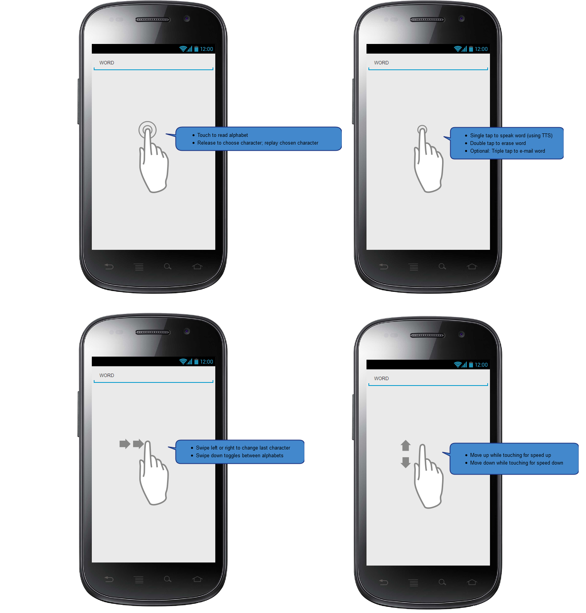

# ABC-TTS
### An alphabet reader Android app to form single words for Text-To-Speech, purely touch and audio based

 

TODO:
 - [x] Adjustable speed (by moving finger up/down while reading alphabet)
 - [x] Alphabet in optimal order (with toggle)
 - [x] Use separate letter .WAV samples instead of 1 sample for whole alphabet
 - [ ] Numbers
 - [ ] Make all parameters configurable via Settings screen
 - [ ] Move away from swipe gestures (or configurable) as they are hard to perform with one hand (not holding the phone)
 - [ ] Keep screen always on (touch only works when screen is on)
 - [ ] Control via button/mouse connected to Android device via USB (but this occupies charging port? -> Bluetooth)
 - [ ] Funny alphabet samples
 - [ ] Generate samples with TTS engine at first startup (instead of embedding samples that might not match the chosen TTS engine)
 - [ ] Change configuration via touch+audio, via a spoken menu like with phone exchanges
 - [ ] Gesture for e-mailing the word (sort of reminder tool)
 - [ ] Read unread mails
 - [ ] Read time, weather, news
 - [ ] Control domotics (i.e. lamps)
 - [ ] Scroll through alphabet with scroll gesture instead of reading it from start to end?
 - [ ] Devide the screen into multiple areas, possibly by putting a thin line of tape on the phone?
 - [ ] Control/play music?
 - [ ] Dictionary?
 
Phone:
 - [ ] Search for good phone to use with ABC-TTS
 - [ ] Good speaker required (HTC BoomSound?)
 - [ ] Front-facing speaker
 - [ ] Wireless change or easy to use charging dock

---
See [KiepProjects](https://github.com/Joozt/KiepProjects) for an overview of all Kiep projects.
